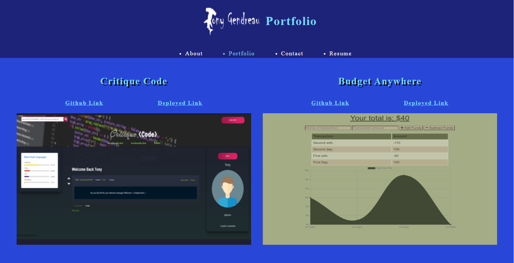

# Reactfolio

---

## Description

This is a re-write of my portfolio, done in REACT!

---

## Table of Contents

[Features](#features)

[Screenshot](#screenshot)

[Installation](#installation)

[License](#license)

[Questions](#questions)

---

## Features

      1. React

      2. Responsive design

      3. Fast

---

## Screenshot

---

## Installation

      1. Go to the website!

&emsp;[Portfolio](https://tgtiburon.github.io/reactfolio/)

---

## License

&emsp; 

      To read about the license of this project click the link below.

&emsp;[License](https://github.com/tgtiburon/Reactfolio/blob/main/LICENSE)

---

## Questions

If you have any questions about this project feel free to email me at <tg.tiburon@gmail.com>.

To see the rest of my portfolio, visit [Github](https://github.com/tgtiburon).

Below is a graphic displaying my most used languages on github.

This Readme file was created with Readme Architect by Tony Gendreau &copy;
